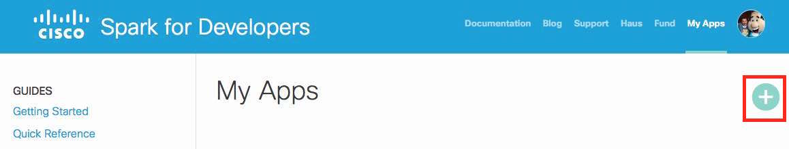
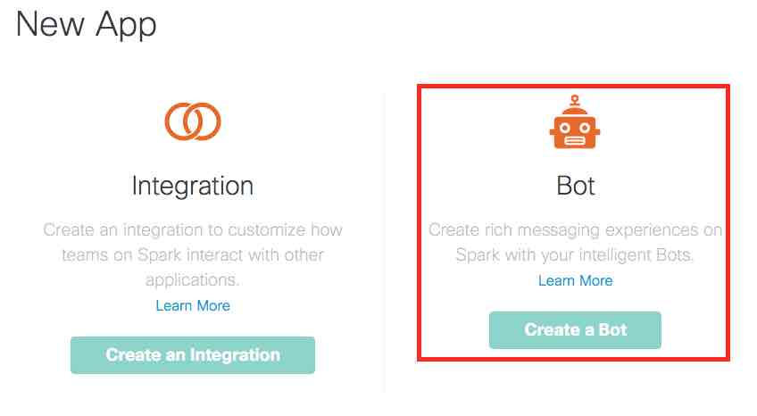
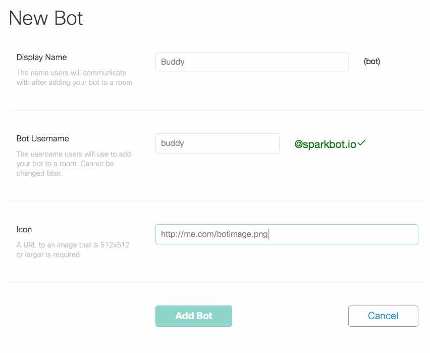
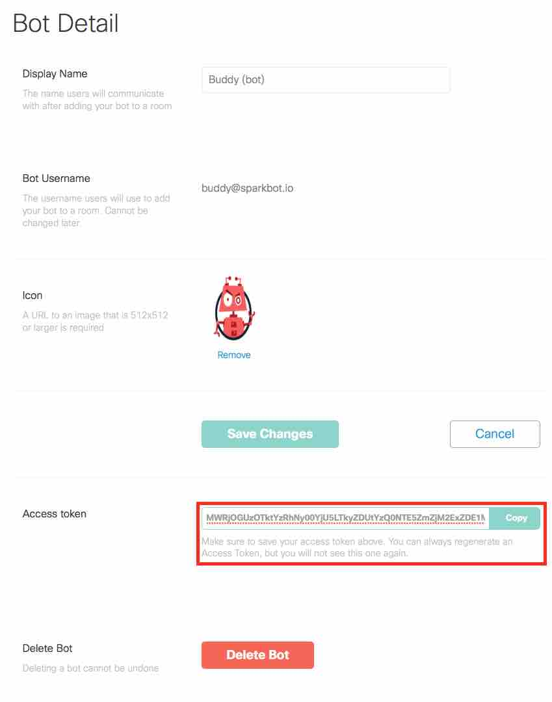
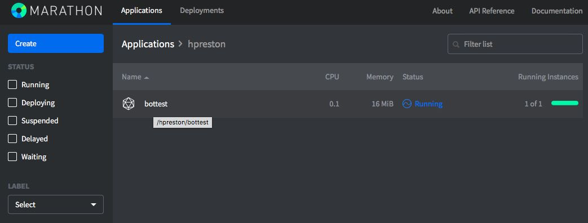
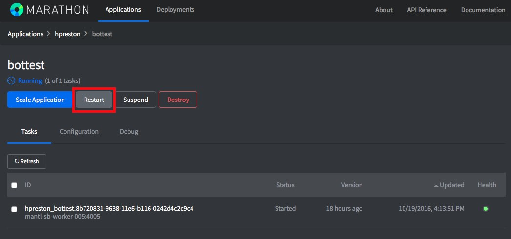

# boilerplate_sparkbot

# Description

This is a sample project that provides the foundation for a Spark Bot.  It includes several basic elements for the bot, allowing the developer to focus on the actions of the bot, not the bot operations.  

This Bot will use a provided Spark Account (identified by the Developer Token) and create a webhook to receive all messages sent to the account.   You will specify a set of command words that the Bot will "listen" for.  Any other message sent to the bot will result in the help message being sent back.

[imapex/boilerplate_sparkbot](https://github.com/imapex/boilerplate_spark) is a starting point application for the [imapex](http://imapex.io) team @ Cisco.

# Spark Account Requirements

There are two strategies for building a Spark Bot.  

1. **Dedicated Spark Account** for the bot.  Here you create a full Spark Account with a unique email address.  

2. **Bot App** within another Spark Account.  Here you create a new *Bot App* under your personal Spark Account.  

Bots created based on this boilerplate can leverage either type of strategy.  You'll just need to provide the correct email and token details when starting the bot code.  

## Dedicated Spark Account 
Create a new Cisco Spark account for your bot, and record it's email and token for use in development and deployment.

You can create new, free account at [CiscoSpark.com](http://ciscospark.com).  You'll need an email address for the bot that hasn't been used with another.  Many users create accounts on Gmail for their bots if you do not have a personal domain/email-host you can use.  

Once your new account is created, log into [developer.ciscospark.com](https://developer.ciscospark.com) to find the new accounts token.  Here is a screenshot of where to locate the information.  


## Bot App 
A newer feature within Cisco Spark, is the ability to create *Bot* apps within another account.  This has the advantage of no longer requiring unique email accounts for each and every new bot you create.  Bot app accounts work nearly the same as full accounts with only a few differences.  Check this [page](https://developer.ciscospark.com/bots.html) for details.  

To create a new Bot App account to use, here are the basic instructions.  

1.  Log into [developer.ciscospark.com](https://developer.ciscospark.com) with your own personal Spark account.  
2. Click on **My Apps** in the top menu, and create a new **Bot** (do not create a new integration).  

	
	---
	
	
3. Provide a *Display Name*, *Bot Username*, and *Icon* URL for your new bot.  The *Bot Username* needs to be unique within Spark, and can **NOT** be changed.  Click **Add Bot**

	
	
4. Record the *Access token* that is displayed on the next page, and **Save Changes**.  If you do NOT copy the token, you can regenerate it.  

	
	
5. Also note the **Bot Username** that is displayed.  This is the ***Bot Email*** that will be needed when setting up your boilerplate code.  

# Building your own Spark Bot

The purpose of this boilerplate is to make it quick and easy to create new Spark Bots by providing a foundation to manage the underlying webhook creation and message sending, and letting the developer focus on the features of the bot being created.  

To get started with your own SparkBot, follow this process.  

***Windows Users - Alternative Instructions:*** [windows_setup](windows_setup.md)

## GitHub and Local Repository Setup

1. Download the setup script
    
    ```
    # move to the directory where you store code for your projects
    # DO NOT create a folder for your new bot
    cd ~/coding 
    
    # Download the script 
    curl -OL https://github.com/imapex/boilerplate_sparkbot/raw/master/setup_and_install/new_bot_setup.sh
    
    # Make the script executable 
    chmod +x new_bot_setup.sh 
    ```
	
	**Windows Version - Requires 7-Zip to be installed and in PATH**
		
    ```
    # move to the directory where you store code for your projects
    # DO NOT create a folder for your new bot
    cd ~/coding 
    
    # Download the script 
    Invoke-WebRequest "https://github.com/imapex/boilerplate_sparkbot/raw/master/setup_and_install/new_bot_setup.ps1" -OutFile "new_bot_setup.ps1"
    ```	
 
2. Run the `new_bot_setup.sh` script

    ```
    ./new_bot_setup.sh
    ```
    
    **Windows Version**
    
    ```
    new_bot_setup.ps1
    ```

	* Provide your GitHub Credentials
		* ***NOTE regarding GitHub 2 Factor Auth***
			* If you have 2FA enabled on your GitHub account, you will need to provide a *Personal Access Token* when prompted for your password
			* Tokens can be generated at [github.com/settings/tokens](https://github.com/settings/tokens)
			* The token must have a minimum of `repo` access, and `delete_repo` access to automate the creation and cleanup of your new bot
	* Provide a name for your new Spark Bot 
    	* This will be used as the GitHub Repo Name
    	* You'll want to use this same name for the Docker Repository you create later
	* The script will 
		* Download the boilerplate_sparkbot code
		* Create a new local directory for your bot with the boilerplate code
		* Delete the downloaded boilerplate code
		* Create a new GitHub Repo on your account for the bot 
		* Push up the boilerplate code to GitHub

## Build and Push Initial Docker Image

1. Build the base bot

    ```
    # Set a couple environment variables to make commands easier
    # Replace the <NAME> with your data
    export BOT_REPO=<GITHUB REPO>
    export BOT_NAME=<YOUR BOT NAME>
    export DOCKER_USER=<DOCKER HUB USERNAME>
    
    # If you aren't in your new Git Repository directory, change into it 
    cd $BOT_REPO
    
    # Build a Docker image
    docker build -t $DOCKER_USER/$BOT_REPO:latest .
    ```
    
2. Push the image to Docker Hub
    * You will need to have logged into Docker Hub on your workstation for this step.  If you haven't done so, you can by running: 

        ```
        docker login 
        ```

    ```
    docker push $DOCKER_USER/$BOT_REPO:latest
    ```

## Deploy your Bot

These steps will deploy your bot to the Cisco DevNet Mantl Sandbox.  This is just one option that is freely available to use, however you can deploy your bot to any infrastructure that meets these requirements:

* Able to run a Docker Container
* Provides a URL for inbound access to running containers from the Internet
    * *Spark needs to be able to reach it with WebHooks*


1. Deploy your Bot.  
    
    ```
    # From the root of your project... 
    cd setup_and_install 
    	
    # Run the install script
    ./bot_install_sandbox.sh 
    ```
    
    **Windows Version**
    
    ```
    # From the root of your project... 
    cd setup_and_install 
    	
    # Run the install script
    ./bot_install_sandbox.ps1
    ```    
    
    * Answer the questions asked
    * When complete, you should see a message that looks like this

    ```
    Your bot is deployed to 

    http://<DOCKER USERNAME>-<BOT NAME>.app.mantldevnetsandbox.com/
    
    You should be able to send a message to yourself from the bot by using this call
    
    curl http://<DOCKER USERNAME>-<BOT NAME>.app.mantldevnetsandbox.com/hello/<YOUR EMAIL ADDRESS>
    
    You can also watch the progress from the GUI at: 
    
    https://mantlsandbox.cisco.com/marathon
    ``` 
    
    **Windows Version**
    
    ```
    Your bot is deployed to 

    http://<DOCKER USERNAME>-<BOT NAME>.app.mantldevnetsandbox.com/
    
    You should be able to send a message to yourself from the bot by using this call
    
    Invoke-WebRequest http://$docker_username-$bot_name.$mantl_domain/hello/<YOUR EMAIL ADDRESS>
    
    You can also watch the progress from the GUI at: 
    
    https://mantlsandbox.cisco.com/marathon
    ```     
    
2. Test that your bot is working by executing the `curl` command shown in your output.  If successfully deployed, you will recieve a message in Spark from your bot.   
3. Reply back to your bot and verify that the default commands are working.  
    * `/help` - should return a help message 
    * `/echo Spark Bots are Awesome!` - should reply back with `Spark Bots are Awesome!`

## Add a New Command to your Bot

Repeat the following steps for each new command you want to add.  
	
1. Add new commands to the command dictionary in bot/bot.py 

	```
	# The list of commands the bot listens for
	# Each key in the dictionary is a command
	# The value is the help message sent for the command
	commands = {
	    "/echo": "Reply back with the same message sent.",
	    "/help": "Get help."
	}
	```
	
2. Create a new Python function for each of your commands.  The function should return the text that will be sent back in reply.  You can use the included 	`send_echo` function as an example.  

	```
	def send_echo(incoming):
	    # Get sent message
	    message = incoming["text"]
	    # Slice first 6 characters to remove command
	    message = message[6:]
	    return message	
	```
	
3. Update the `if ...elif` section of the `process_incoming_message` function for your new command.  

	```
	# Some of function removed below
	def process_incoming_message(post_data):
	    # Take action based on command
	    # If no command found, send help
	    if command in ["","/help"]:
	        reply = send_help(post_data)
	    elif command in ["/echo"]:
	        reply = send_echo(message)
	
	    send_message_to_room(room_id, reply)	
	```

## Update your running bot

1. Build and Push a new Docker Image

    ```
    # If you've opened a new terminal sense setting before
    export BOT_REPO=<GITHUB REPO>
    export BOT_NAME=<YOUR BOT NAME>
    export DOCKER_USER=<DOCKER HUB USERNAME>

    
    # Build a Docker image
    docker build -t $DOCKER_USER/$BOT_REPO:latest .
    docker push $DOCKER_USER/$BOT_REPO:latest
    ```

2. Restart your Bot in the DevNet Sandbox.  Two options for this. 
    * Through the Marathon GUI
        1. Login to Marathon at [https://mantlsandbox.cisco.com/marathon/](https://mantlsandbox.cisco.com/marathon/)
            * Username/Password: admin/1vtG@lw@y
        2. Find your running Application.  It will be in a folder matching your Docker Username.  
            
        3. Click on your application, and then click **Restart**
            
        4. Wait until the new task shows as **Healthy** 
    * Using the API 
        1. Use this curl command to restart your application through the API.  

            ```
            curl -kX POST \
                -H "content-type: application/json" \
                -u admin:1vtG@lw@y \
                https://mantlsandbox.cisco.com/marathon/v2/apps/$DOCKER_USER/$BOT_NAME/restart?force=true
            ```

        2. Use this curl command to check the status of the deployment.  

            ```
            curl -kX GET \
                -u admin:1vtG@lw@y \
                https://mantlsandbox.cisco.com/marathon/v2/apps/$DOCKER_USER/$BOT_NAME \
                | python -m json.tool \
                | egrep "tasksHealthy|tasksRunning|tasksStaged"
                
            # Wait until output matches this (1 Health, 1 Running, and 0 Staged)
            "tasksHealthy": 1,
            "tasksRunning": 1,
            "tasksStaged": 0,
            ```
            
## Reconfigure the bot with Spark Account Details

In order for your Bot to work, it needs to have the Spark Username (email address), and Spark Token configured.  There are two options for configuring these details

1. Provide them as Environment Variables as the bot code starts up.  
    * This requires that both the email and token be listed in clear text in any application configuration settings.  
2. Provide them via a REST API call after the bot code starts up. 
    * This can keep the details more secure, but means that you need to reconfigure the bot each time it restarts.

When leveraging the DevNet Mantl Sandbox, the default installation behavior is the second, more secure, option.  This means each time you update your bot, you'll need to reset the credentials with this process.  

```
# Store the application details as Variables for easier API request building
export DOCKER_USER=<DOCKER USERNAME>
export BOT_NAME=<YOUR BOT NAME>
export SPARK_EMAIL=<SPARK BOT EMAIL>
export SPARK_TOKEN=<SPARK BOT TOKEN>
    
        
curl -X POST \
    http://$DOCKER_USER-$BOT_NAME.app.mantldevnetsandbox.com/config \
    -d '{"SPARK_BOT_TOKEN": "'$SPARK_TOKEN'", "SPARK_BOT_EMAIL": "'$SPARK_EMAIL'"}'         
    
```    

### Configuration Update Script

A bash script is included in the `setup_and_install` directory that will do the configuration update for you.  

```
cd setup_and_install
./bot_config.sh
```

**Windows Version**

```
cd setup_and_install
./bot_config.ps1
```

#### Completed Configuration Message Example
```
Checking if Bot is up
HTTP Status: 200

Bot is up.  Configuring Spark.
Bot Configuration:
{"SPARK_BOT_TOKEN": "REDACTED", "SPARKBOT_APP_NAME": "<BOT NAME>", "SPARK_BOT_URL": "http://<DOCKER USER>-<BOT NAME>.app.mantldevnetsandbox.com", "SPARK_BOT_EMAIL": "angelbot@sparkbot.io"}
```


# Deleting your SparkBot

## Uninstalling your Bot

1. An uninstallation script is provided to uninstall your bot from the DevNet Sandbox.  

    ```
	# From the root of your project... 
	cd setup_and_install 
	
	# Run the uninstall script
	./bot_uninstall_sandbox.sh 
	```
	
    **Windows Version**	
    
    ```
	# From the root of your project... 
	cd setup_and_install 
	
	# Run the uninstall script
	./bot_uninstall_sandbox.ps1 
	```


## Deleting the GitHub Repo and Code 

**Caution: This step will delete both your local copy of your code & on GitHub**

1.  A cleanup script is provided that will delete your bot code both locally and on GitHub.  From your Spark Bot's local root directory

	```
	# From the root of your project... 
	cd setup_and_install 
	
	# Fun the cleanup script
	./new_bot_cleanup.sh
	
	```
	
	**Windows Version**
	
	```
	# From the root of your project... 
	cd setup_and_install 
	
	# Fun the cleanup script
	./new_bot_cleanup.ps1
	
	```

	
2. Provide your GitHub Credentials and the name of your Bot.  The script will 

	* Delete your repository from GitHub
	* Delete the local code from your workstation 

## Manual Steps

You will manually need to 

* Delete any other running instances of your application
* Delete any Docker (or other container registry) Repositories for your Bot 
* Clear any WebHooks from the Spark Account you created for your bot


# Other Application Details

Some more information on the details of this boilerplate application.  

## Environment

Prerequisites

* Python 2.7+
* [setuptools package](https://pypi.python.org/pypi/setuptools)

## Downloading

Provide instructions for how to obtain the software from this repository, if there are multiple options - please include
as many as possible

Option A:

If you have git installed, clone the repository

    git clone https://github.com/imapex/boilerplate_sparkbot

Option B:

If you don't have git, [download a zip copy of the repository](https://github.com/imapex/boilerplate_sparkbot/archive/master.zip)
and extract.

Option C:

The latest build of this project is also available as a Docker image from Docker Hub

    docker pull imapex/boilerplate_sparkbot:latest

# Local Development Usage

The bot is designed to be deployed as a Docker Container, and can run on any platform supporting Docker Containers.  Mantl.io is one example of a platform that can be used to run the bot.

***NOTE: For full functionality, this bot needs to be installed in an environment where the bot application is available on the public internet in order for the Spark Cloud to be able to send WebHooks to the bot.  If you do NOT have an environment to use, the DevNet Sandbox Mantl cluster can be leveraged to host your bot.***  

## Development Usage for Webhooks with Spark 

For development, you may want to run your bot code locally on your workstation.  If you do this, there is (typically) no way for Webhooks from the Spark cloud to directly access your code running on your laptop.  To get around this, you can leverage the [RequestB.in](http://requestb.in) service as a middleman between Spark and your local workstation.  This service will give you a publically available URL that you use as the **SPARK\_BOT\_URL** parameter.  Spark will then send Webhooks to this local service where you can view the details of the request, and then manually send it to your bot running on your laptop.  

## Running Python Code Locally 

There are several pieces of information needed to run this application.  These details are provided Environment Variables to the application.
*Be sure to use valid details for the environment variables*

If you are running the python application directly, you can set them like this:

```
# Details on the Cisco Spark Account to Use
export SPARK_BOT_EMAIL=myhero.demo@domain.com
export SPARK_BOT_TOKEN=adfiafdadfadfaij12321kaf

# Public Address and Name for the Spark Bot Application
export SPARK_BOT_URL=http://myhero-spark.mantl.domain.com
export SPARK_BOT_APP_NAME="imapex bot"

# Start the bot
python bot/bot.py

```

## Locally building and running the Docker Container 

There are several pieces of information needed to run this application.  These details are provided Environment Variables to the application.
*Be sure to use valid details for the environment variables*

You can build and run the Spark Bot as a Docker Container locally with these commands.  

```
docker build -t sparkbot .
docker run -it --name sparkbot \
   -p 5000:5000 \
	-e "SPARK_BOT_EMAIL=myhero.demo@domain.com" \
	-e "SPARK_BOT_TOKEN=adfiafdadfadfaij12321kaf" \
	-e "SPARK_BOT_URL=http://myhero-spark.mantl.domain.com" \
	-e "SPARK_BOT_APP_NAME='imapex bot'" \
	sparkbot
```

# Development

The purpose of this boilerplate, and all other boilerplates created by the imapex team, is to make it quick and easy to create new Spark Bots by providing a foundation to manage the underlying webhook creation and message sending, and letting the developer focus on the features of the bot being created.  

If you'd like to contribute to this boilerplate with bug fixes or enhancements, we welcome you to the team.  Simply fork the main [imapex/boilerplate_sparkbot](https://github.com/imapex/boilerplate_spark) repository, make your improvements, and send us a Pull Request.  

## Linting

We use flake 8 to lint our code. Please keep the repository clean by running:

    flake8

## Testing

**TODO - Create tests for SPARKBOT BOILERPLATE**

The IMAPEX team should attempt to have unittests with  100% code coverage. An example test suite is contained
within the tests.py file for the boilerplate application

The tests are can be run in the following ways::

    python tests.py


When adding additional code or making changes to the project, please ensure that unit tests are added to cover the
new functionality and that the entire test suite is run against the project before submitting the code.
Minimal code coverage can be verified using tools such as coverage.py.

For instance, after installing coverage.py, the toolkit can be run with the command::

    coverage run tests.py

and an HTML report of the code coverage can be generated with the command::

    coverage html


